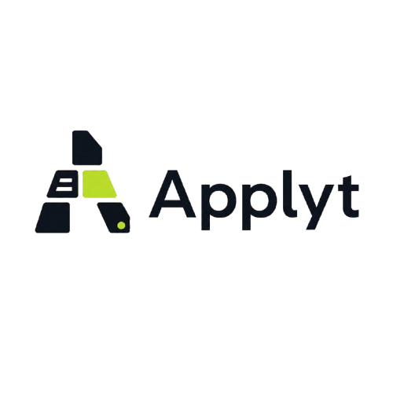

<div align="center">



# Applyt — AI Career Toolkit

**Your unfair advantage in the job market.**  
Applyt is an AI-powered career toolkit that gives every job seeker a senior recruiter's eye, an ATS optimizer, a professional cover letter writer, and a personal career mentor — all in one sleek application.

[](https://python.org)
[](https://streamlit.io)
[](https://langchain.com)
[](https://openrouter.ai)
[](LICENSE)

</div>

---

## Table of Contents

- [Overview](#overview)
- [Features](#features)
- [Tech Stack](#tech-stack)
- [Project Structure](#project-structure)
- [Getting Started](#getting-started)
- [Configuration](#configuration)
- [Tool Deep Dives](#tool-deep-dives)
- [Design System](#design-system)
- [Architecture Decisions](#architecture-decisions)
- [Roadmap](#roadmap)
- [Contributing](#contributing)
- [License](#license)

---

## Overview

The modern job market is brutal. Applicant Tracking Systems reject 75% of resumes before a human ever reads them. Generic cover letters go straight to the bin. Candidates waste weeks applying to the wrong roles. Career advice online is vague, outdated, and built for no one in particular.

**Applyt exists to fix that.**

Built by a developer obsessed with GenAI and real-world career outcomes, Applyt combines state-of-the-art language models with recruiter-grade evaluation logic to give every user the kind of feedback that only a senior hiring manager at a top company could previously provide — and it does it in under 30 seconds.

Whether you're a fresher applying for your first role, a mid-level engineer switching industries, or a senior professional targeting leadership positions, Applyt adapts to your level and tells you exactly what needs to change.

---

## Features

### 🔍 Quick Resume Checker
Upload your resume and get a structured, honest evaluation in seconds.

- **100-point scoring rubric** across 6 weighted dimensions
- **Auto-detects experience level** (Fresher / Mid / Senior) and adjusts scoring expectations accordingly
- **Strengths & weaknesses** — specific, not generic
- **Detected vs. missing skills** — shown as visual tag pills
- **Next roles you can target** — based on your actual background
- **Ranked improvement suggestions** — actionable fixes, not platitudes
- **ATS label** (Poor / Fair / Good / Excellent) for quick at-a-glance assessment

**Scoring Rubric:**

| Category | Max Points |
|---|---|
| Content Quality | 20 |
| Skills & Technical Depth | 20 |
| Impact & Achievements | 20 |
| Structure & Formatting | 15 |
| ATS Optimization | 15 |
| Projects & Practical Work | 10 |

---

### 📊 Resume Matcher & Scorer
Paste any job description alongside your resume and get a deep compatibility analysis.

- **Overall match percentage** against the JD
- **Keyword match analysis** — which keywords you have, which you're missing
- **ATS compatibility score** and **reliability score**
- **Format analysis** with specific issues called out
- **Skill gap analysis** — present skills vs. required skills with a gap summary
- **Industry-specific feedback** tailored to the role's domain
- **Prioritized improvement suggestions** for that exact JD

This tool is designed for serious job hunters who don't want to mass-apply blindly but instead want to surgically tailor their resume for every high-priority application.

---

### ✉️ Cover Letter Generator
Generate a tailored, 300–450 word cover letter from your resume and a job description. No boilerplate. No "I am writing to apply for."

- **Strong opening hook** that shows genuine interest in the specific role
- **Skills-to-JD mapping** in paragraph 2 — your actual experience, not fabricated claims
- **Unique value paragraph** — what makes you different from the 200 other applicants
- **Confident closing** with a clear call to action
- Extracts your **name, city, and email** directly from the resume
- **Streaming output** — watch the letter write itself in real time
- **Download as `.txt`** for instant use

---

### 🗣️ Career Coach Chatbot
A full conversational AI career mentor that has read your resume and remembers everything about you.

- **Resume-aware** — every response references your actual projects, skills, and experience
- **Two-panel layout** — your resume on the left, the chat on the right
- **Quick-action buttons** for the most common questions:
  - What roles should I target?
  - What are my biggest resume gaps?
  - Give me a mock interview question
  - What skills should I learn next?
- **Full conversation history** maintained within the session
- **Streaming responses** — no waiting, answers appear word by word
- Persona: 20 years of recruiting and career coaching experience at Google, Amazon, and top-tier startups

---

## Tech Stack

| Layer | Technology |
|---|---|
| **Frontend / App** | [Streamlit](https://streamlit.io) |
| **LLM Orchestration** | [LangChain](https://langchain.com) (`langchain-openai`, `langchain-community`) |
| **Language Model** | `meta-llama/llama-4-scout` via [OpenRouter](https://openrouter.ai) |
| **PDF Parsing** | `langchain_community.document_loaders.PyPDFLoader` |
| **Environment Management** | `python-dotenv` |
| **Image Handling** | `Pillow` |
| **Fonts** | Space Grotesk + Plus Jakarta Sans (Google Fonts) |
| **Styling** | Custom CSS design system via `st.markdown` |

---

## Project Structure

```
applyt/
│
├── app.py                              # Main application — all tools unified
├── Applytlogo-removebg-preview.png     # Brand logo (place in root dir)
├── .env                                # API keys (not committed)
├── .env.example                        # Template for environment setup
├── requirements.txt                    # Python dependencies
└── README.md                           # You are here
```

> **Note:** The application is intentionally kept as a single `app.py` file. All tools share utilities, the LLM client, and the session state router — making deployment, maintenance, and iteration as simple as possible.

---

## Getting Started

### Prerequisites

- Python 3.10 or higher
- An [OpenRouter](https://openrouter.ai) account and API key (free tier available)

### 1. Clone the repository

```bash
git clone https://github.com/yourusername/applyt.git
cd applyt
```

### 2. Create a virtual environment

```bash
python -m venv venv
source venv/bin/activate        # macOS / Linux
venv\Scripts\activate           # Windows
```

### 3. Install dependencies

```bash
pip install -r requirements.txt
```

### 4. Configure environment variables

```bash
cp .env.example .env
```

Open `.env` and add your OpenRouter API key:

```env
OPENROUTER_API_KEY=sk-or-xxxxxxxxxxxxxxxxxxxx
```

### 5. Run the application

```bash
streamlit run app.py
```

The app will open at `http://localhost:8501` in your browser.

---

## Configuration

### `requirements.txt`

```
streamlit>=1.35.0
langchain>=0.2.0
langchain-openai>=0.1.0
langchain-community>=0.2.0
python-dotenv>=1.0.0
pypdf>=4.0.0
Pillow>=10.0.0
```

### `.env.example`

```env
# OpenRouter API key — get yours at https://openrouter.ai
OPENROUTER_API_KEY=sk-or-your-key-here
```

### Changing the Language Model

The model is configured once via `@st.cache_resource` in `app.py`:

```python
@st.cache_resource
def get_chat():
    return ChatOpenAI(
        model="meta-llama/llama-4-scout",   # ← swap model here
        api_key=os.getenv("OPENROUTER_API_KEY"),
        base_url="https://openrouter.ai/api/v1",
    )
```

OpenRouter gives you access to hundreds of models (GPT-4o, Claude 3.5, Gemini Pro, etc.) — just swap the model string. No other code changes required.

---

## Tool Deep Dives

### Experience Level Detection

The Quick Resume Checker auto-detects seniority before scoring, so a fresher isn't penalized for lacking 5 years of experience:

```python
def detect_level(text: str) -> str:
    t = text.lower()
    if any(s in t for s in ["staff", "principal", "director", "vp ", "8+ years", "10+ years"]):
        return "senior"
    if any(s in t for s in ["2 years", "3 years", "4 years", "senior", "lead"]):
        return "mid"
    return "fresher"
```

Each level gets a distinct evaluation context injected into the scoring prompt, shifting weight between projects/academics (fresher), experience quality (mid), and leadership/impact (senior).

### JSON Safety

All structured outputs (Resume Checker, Resume Matcher) use a defensive JSON parser that strips markdown code fences before parsing — handling the common pattern where models wrap JSON in ` ```json ``` ` blocks:

```python
def safe_json(raw: str) -> dict:
    cleaned = raw.strip()
              .removeprefix("```json")
              .removeprefix("```")
              .removesuffix("```")
              .strip()
    return json.loads(cleaned)
```

### Streaming

All four tools use LangChain's `.stream()` interface so users see output appear in real time — critical for perceived performance, especially for cover letter generation and career coach responses.

### Session State Architecture

The Career Coach maintains full conversation history in `st.session_state` across reruns:

```python
st.session_state.coach_history   # list of HumanMessage / AIMessage
st.session_state.coach_system    # SystemMessage with full resume injected
st.session_state.coach_context   # raw resume text
```

A new upload triggers a full reset, ensuring the coach's context always matches the active resume.

---

## Design System

Applyt uses a custom CSS design system built entirely within Streamlit's `st.markdown` injection layer. No external frontend framework required.

### Color Palette

| Token | Value | Usage |
|---|---|---|
| `--bg` | `#0A0F1A` | Main background |
| `--surface` | `#0E1525` | Sidebar background |
| `--card` | `#131E30` | Card / input backgrounds |
| `--lime` | `#C8F135` | Primary accent — brand color |
| `--lime-dim` | `#9BBD1C` | Progress bars, secondary accents |
| `--red` | `#FF4E6A` | Error states, missing skills |
| `--amber` | `#FFB547` | Warnings, target roles |
| `--text` | `#EDF2FF` | Primary text |
| `--text-2` | `#8A9BB5` | Secondary / muted text |
| `--text-3` | `#4E637A` | Labels, metadata |

### Typography

| Role | Font | Weight |
|---|---|---|
| Headings | Space Grotesk | 700 |
| Body | Plus Jakarta Sans | 400 / 500 / 600 |

### Key UI Patterns

- **Page headers** have a 60px lime underline accent bar
- **Metric cards** have a lime gradient bottom border
- **Feature cards** have a top-edge lime shimmer on hover
- **Buttons** have a lime glow box-shadow and lift on hover
- **File uploader** uses a dashed lime border that brightens on hover
- **Tool pages** animate in with a `fadeUp` keyframe (350ms)
- **Scrollbar** turns lime on hover

---

## Architecture Decisions

**Single-file architecture** — Everything lives in `app.py`. For a Streamlit application of this size and purpose, a single file makes deployment trivial, eliminates import complexity, and keeps the codebase approachable for contributors.

**OpenRouter over direct API calls** — OpenRouter acts as a universal LLM gateway. This means swapping from Llama 4 Scout to GPT-4o or Claude 3.5 Sonnet requires changing exactly one string. Future model upgrades have zero migration cost.

**LangChain for prompting and streaming** — LangChain's `PromptTemplate` + `ChatOpenAI.stream()` gives clean separation between prompt definitions and execution, with built-in streaming support.

**`@st.cache_resource` for the LLM client** — The ChatOpenAI client is instantiated once per server session and reused across all tool calls and reruns, avoiding repeated initialization overhead.

**No database / no auth (v1)** — Deliberately kept stateless. No user accounts, no persistent storage, no cloud dependencies beyond the LLM API. This makes local deployment and self-hosting trivially simple.

---

## Roadmap

The following features are planned for upcoming releases:

- [ ] **Resume Builder** — Build an ATS-optimized resume from scratch with AI guidance
- [ ] **LinkedIn Optimizer** — Rewrite your LinkedIn summary and headline based on target roles
- [ ] **Interview Simulator** — Full mock interview with voice support and real-time feedback
- [ ] **Job Tracker** — Save applications, track status, and get follow-up reminders
- [ ] **Salary Intelligence** — Market rate lookup by role, level, and location
- [ ] **Multi-resume support** — Store and compare multiple resume versions
- [ ] **User accounts** — Persistent history, saved cover letters, tracked improvements
- [ ] **Deployment pipeline** — One-click deploy to Streamlit Cloud / Railway / Render
- [ ] **API mode** — Headless endpoints for integration with job boards and career platforms

---

## Contributing

Contributions are welcome. Here's how to get involved:

1. Fork the repository
2. Create a feature branch: `git checkout -b feature/your-feature-name`
3. Make your changes — keep the single-file architecture and don't break existing tool functionality
4. Test locally: `streamlit run app.py`
5. Submit a pull request with a clear description of what you've added and why

### Contribution Guidelines

- Keep all functionality in `app.py` unless the feature genuinely requires a separate module
- Follow the existing CSS variable system — don't hardcode colors
- All new LLM prompts must return structured JSON with a `safe_json()` fallback
- Prompts must explicitly instruct the model not to fabricate information not present in the resume
- New pages must be registered in the `PAGES` dict and handled in the router at the bottom of the file

---

## License

MIT License — see [LICENSE](LICENSE) for details.

---

<div align="center">

Built with care by a developer who believes every job seeker deserves a fair shot.

**[⚡ Try Applyt](http://localhost:8501)** &nbsp;·&nbsp; [Report a Bug](https://github.com/yourusername/applyt/issues) &nbsp;·&nbsp; [Request a Feature](https://github.com/yourusername/applyt/issues)

</div>
